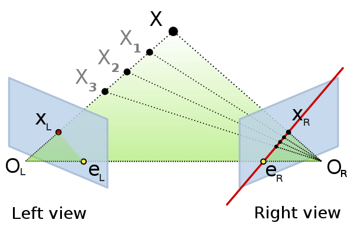
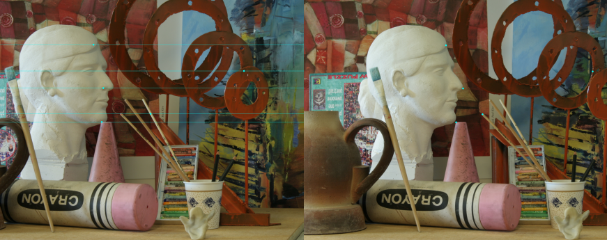
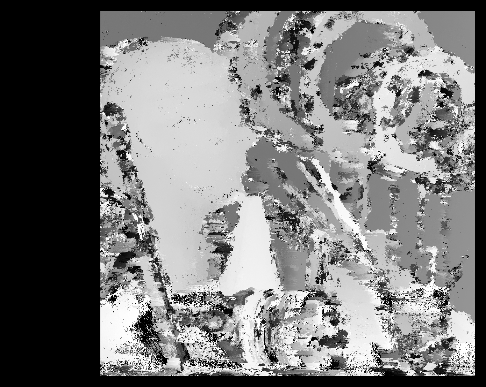
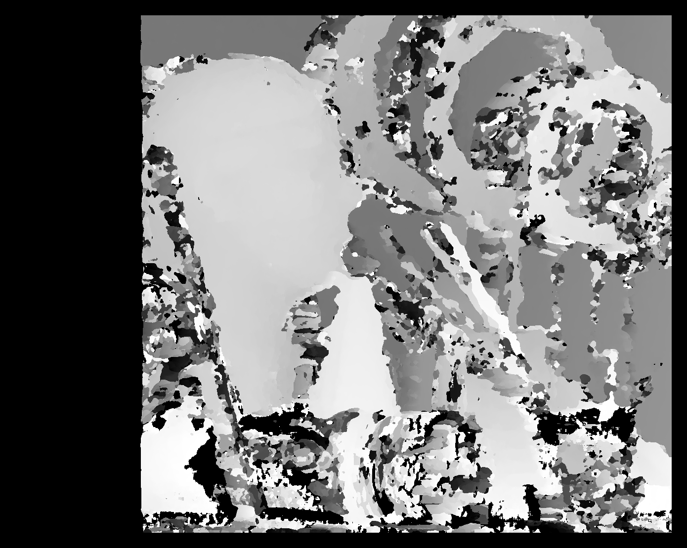

# disparity
This implementation takes in two rectified images and computes the disparity between the images. For a stereo pair, intrinsic parameters must be known in order to rectify the images and in consecutive monocular images, both intrinsic and extrinsic parameters must be known for epipolar rectification.  


## Theory and Algorithm 

### Disparity 
Disparity refers to the distance between two corresponding points in the left and right image of a stereo pair or between two consecutive images from a monocular camera in which you would have to perform triangulation. If you look at the image below you see a labelled point X (ignore X1, X2 & X3). By following the dotted line from X to OL you see the intersection point with the left hand plane at XL. The same principal applies with the right-hand image plane.



If X projects to a point in the left frame XL = (u,v) and to the right frame at XR = (p,q) you can find the disparity for this point as the magnitude of the vector between (u,v) and (p,q). Obviously this process involves choosing a point in the left hand frame and then finding its match (often called the corresponding point) in the right hand image; often this is a particularly difficult task to do without making a lot of mistakes.

### Disparity Image
If you were to perform this matching process for every pixel in the left hand image, finding its match in the right hand frame and computing the distance between them you would end up with an image where every pixel contained the distance/disparity value for that pixel in the left image. By matching every pixel in the left hand image with its corresponding pixel in the right hand image and computing the distance between the pixel values (the disparities) you should end up with disparity image. Various techniques such as block matching are performed using a window of certain size sliding over each pixel in the left image and finding the best match in the right image. This would however be a 2 dimensional search in the right image. To reduce this search to 1 dimension that is horizontal, you can make use of [Epipolar Geometry](https://en.wikipedia.org/wiki/Epipolar_geometry) and [Image Rectification] (https://en.wikipedia.org/wiki/Image_rectification). This will make the process of matching pixels in the left and right image considerably faster. 


The algorithm or the steps that I follow to compute disparity images are as follows:
- Populate keypoints or detect keypoints. I consider each pixel of both the left and right image as a keypoint. This will generate a dense disparity image.
- Extract the detected features using [ORB descriptor](https://medium.com/software-incubator/introduction-to-orb-oriented-fast-and-rotated-brief-4220e8ec40cf).
- Now, for descriptor matching we need to know if the images are rectified or not. The given images seem to be rectified since the corresponding point of the left image lies on the same line in the right image. this is shown below. This is simply done by writing a simple callback function with a mouse click.

 

- For descriptor matching I use the `L1_norm(D1(i,j), D2(i-d, j))` to compute the cost between point in left and point in right image. Where `D1` is the descriptor for `point (i, j)` in left image and and `point(i-d, j)` in the right image. Here `d` is the parameter entered by user resulting in the best disparity image. In our case `d = 256` works the best.
- Once best descriptor match is found the disparity is computed and stored in an empty opencv image.
- This process is done for each keypoint i.e. each pixel in the left/ first image. 
- I also maintain a window based cost computation where the neighbors of the point of interest are also taken into consideration while matching. However, I have left the size of the window to be zero since this gives be the result faster if compromised on the quality. You can change the value to 5 or 7 (or higher odd number < image_height) for better result. 
- I use OpenCV for image manipulation and use its ORB feature point detector and descriptor for extracting keypoints and respective descriptors.
- I also use [OpenMP](https://www.openmp.org/) for parallel programming. Number of threads assigned = 8. 


## Results
The resulting disparity image is shown below. 

### For w = 0 




### w = 3



### w = 5


## Implementation

The code skeleton for this project is as follows

The `disparity-test.cpp` and `disparity.cpp` program in under the `src` directory, and the `disparity.h` under the the `include` directory. 
```
.
├── disparity-test.cpp
├── disparity.cpp
└── disparity.h
```


## Dependencies

* cmake >= 2.8
  * All OSes: [click here for installation instructions](https://cmake.org/install/)
* make >= 4.1 (Linux, Mac), 3.81 (Windows)
  * Linux: make is installed by default on most Linux distros
  * Mac: [install Xcode command line tools to get make](https://developer.apple.com/xcode/features/)
  * Windows: [Click here for installation instructions](http://gnuwin32.sourceforge.net/packages/make.htm)
* gcc/g++ >= 5.4
  * Linux: gcc / g++ is installed by default on most Linux distros
  * Mac: same deal as make - [install Xcode command line tools](https://developer.apple.com/xcode/features/)
  * Windows: recommend using [MinGW](http://www.mingw.org/)
* OpenCV >= 3.0
* OpenMP 

## Build

1. Clone this repo.
2. Make a build directory: `mkdir build && cd build`
3. Compile: `cmake .. && make` 
4. Run it: `./disparity-test ./data/img1.png ./data/img2.png`
